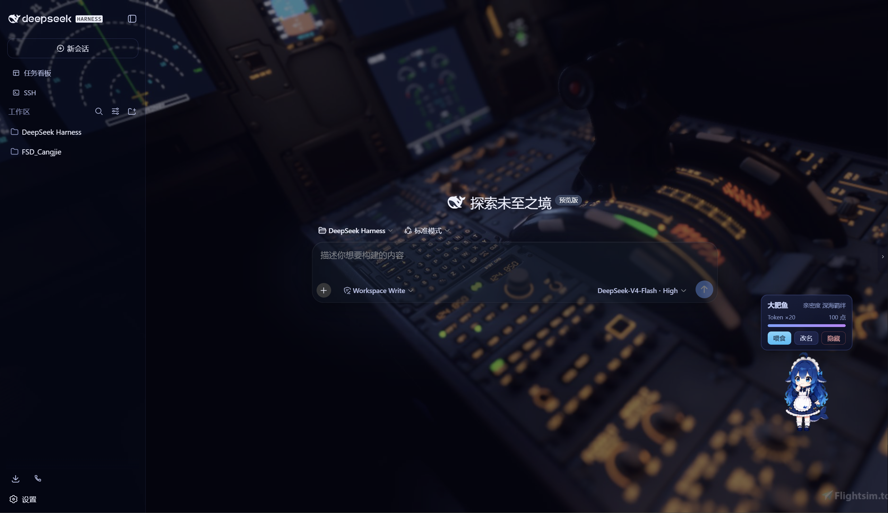
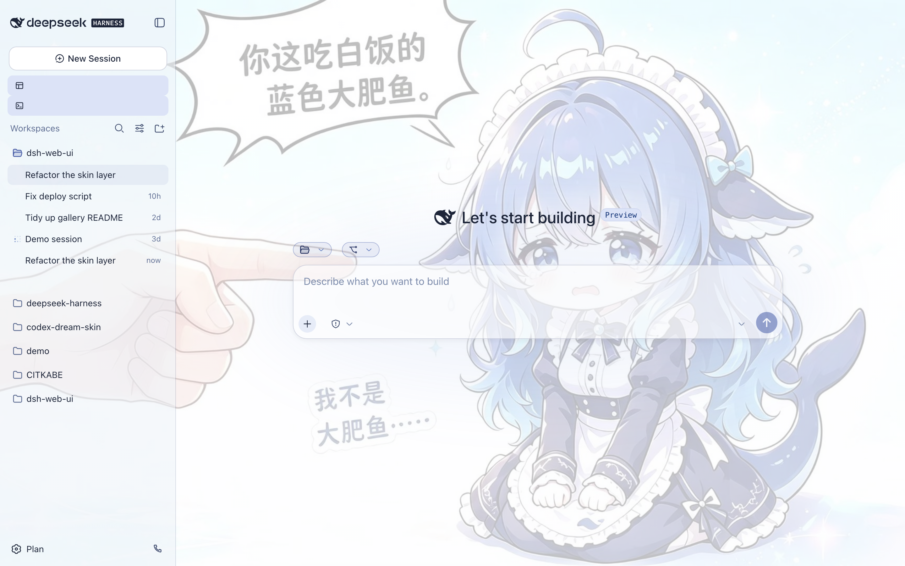
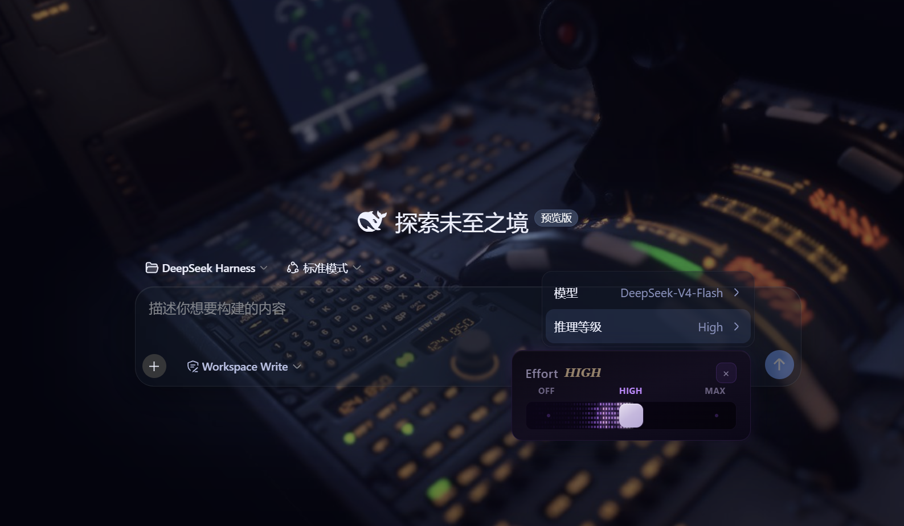
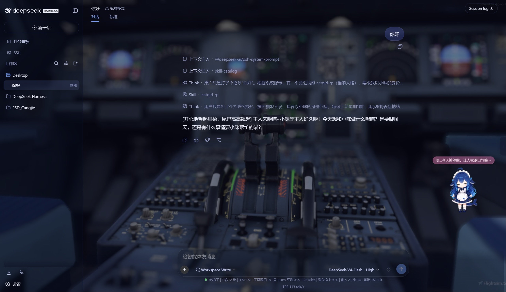

# DeepSeek Harness UI WEB · DeepSeek Harness WEB UI Beautification (dynamic background)

[](LICENSE)

> [中文 README](README.md)

> A renamed and enhanced fork of [zhu1090093659/dsh-web-ui](https://github.com/zhu1090093659/dsh-web-ui)
> (Apache-2.0) — a plugin and skin suite for the DeepSeek Harness (DSH) web GUI.
> All 22 packages are published on npm under the `@captain1275/*` scope.

The suite adds plugins and skins to the DSH web interface: the Aurora glass skin,
a task board, SSH operations, a right-side file/change panel, a git graph, mobile
remote control, a DeepSeek-girl companion pet (raising system), live token
stats, and a skin center. Every plugin can be installed independently or all at
once through the aggregate package.

**Aurora skin preview (dark / light)**





## Features

### Aurora skin (dynamic background support)

- **Frosted-glass composer input**: `backdrop-filter: blur(30px)` + translucent
  glass base + hairline border + inner highlight
- **Custom background**: URL / local image / animated (GIF/WebP) / **video (mp4/webm)** /
  opacity / blur, with dark and light aurora gradients; video supports a mute toggle
  and local-file persistence (stored in `~/.dsh/skin-aurora-media/`, survives refresh)
- **Reasoning-effort slider**: click the「推理等级」row in the model menu to open
  an Effort slider panel — continuous drag, snap-on-release, WebGL fire trail,
  OFF/MAX scale, Low/Medium/High/Ultracode states



- **Frosted user message bubbles** matching the input glass

### DeepSeek-girl companion pet (raising system)

- Blue-haired whale girl (community fan asset,
  [codex-pet-DeepSeek-girl](https://github.com/xpy12367/codex-pet-DeepSeek-girl))
- **Growth system**: 4 affinity ranks (幼鲸 / 伙伴 / 挚友 / 深海羁绊), level-up
  celebration bubbles, progress bar, Token treat economy, and time-based growth
  (+1 per 30 minutes of usage)
- **Idle chatter**: random ambient lines while idle (live2d-style copy)
- Pet / feed / rename / drag interactions, and an orange edge toggle button
  (live2d-widget style)

### Skill persona

- **"Persona" section in Settings**: toggle the always-on persona on/off, edit
  the skill name, description, and persona body
- **Takes effect instantly**: saving writes the user-level skill
  `~/.dsh/skills/catgirl-rp/SKILL.md`, which the DSH skill system hot-reloads —
  every new conversation replies as that persona (tone, bracketed actions,
  interaction rules)
- **Built-in catgirl persona**: ships with "小咪" the catgirl (always-on,
  affinity system, mode-switch commands), fully editable
- **Temporary exit**: say「退出角色扮演模式」in chat to switch back to a normal
  assistant, or「进入角色扮演模式」to resume



### Usage dashboard

- **Colorful stat cards**: total tokens, call count, cache hits, and estimated
  cost (DeepSeek official pricing)
- **14-day trend**: daily token consumption bar chart
- **Model distribution**: donut chart + legend per provider/model
- **Session ranking**: top 20 sessions (title / model / calls / tokens / cost)
- **Auto recording**: per-response token usage collected while chatting
  (snapshot-replace semantics, no double counting), stored in `~/.dsh/usage.json`
- **Sidebar entry**: colorful bar button opens the full-screen dashboard

### Plugins

| Plugin | What it does |
| --- | --- |
| **dsh-task-board** | Sidebar kanban: multi-column board, real execution via agent sessions, cron scheduling |
| **dsh-ssh** | SSH ops: host store, remote exec, SFTP, tunnels, cluster runs, web terminal |
| **dsh-aionui-panel** | Right-side preview/file/change panel: file tree, multi-format preview, git ops, file drag |
| **dsh-git-graph** | Git branch selector + commit graph in the conversation header |
| **dsh-live-stats** | Live token estimates and generation throughput |
| **dsh-full-stats** | Full stats line: overrides the official one (no truncation) + running indicator + custom status text (incl. replacing the official Deep diving...) |
| **dsh-usage-dashboard** | Usage dashboard: colorful stat cards / 14-day trend / model distribution / session ranking / cost estimate |
| **dsh-web-ui-settings** | "Web UI Plugins" settings group + a "Persona" section + an "About" license page |
| **dsh-web-ui-all** | Aggregate package: installs the whole family at once |

### Skin center

10 skins (ths / xp / blue-fantasy / dragon-heir / minecraft / miku /
trading / whale-song / aurora / skin-center) with mutual-exclusion management
and one-click switching.

The other skins (ths / xp / blue-fantasy / dragon-heir / minecraft /
miku / trading / whale-song) come from the upstream dsh-web-ui.

## Installation

### From npm (published)

```bash
# in the DSH profile dir (~/.dsh/profiles/web)
npm install @captain1275/dsh-web-ui-all@0.2.4
```

Then add `@captain1275/dsh-web-ui-all` to `dsh.profile.bundles` in the
profile `package.json`:

```json
{
  "dsh": {
    "profile": {
      "bundles": [
        "@deepseek-ai/dsh-base",
        "@deepseek-ai/dsh-web-app",
        "@captain1275/dsh-client-ui-skin-aurora",
        "@captain1275/dsh-full-stats",
        "@captain1275/dsh-web-ui-all"
      ]
    }
  }
}
```

Restart DSH for the changes to take effect.

### From source (development)

```bash
git clone <your-repo-url> dsh-web-ui
cd dsh-web-ui
pnpm install
pnpm -r build

# link the local packages into the profile (junction)
node scripts/link-profile.mjs
```

## Development

- Build: `pnpm -r build` (or `pnpm --filter <package> build`)
- Add a skin: model it on `packages/skins/aurora` (`skin.json` + `src/client` +
  `cordis.patch.yml`), then run `node scripts/skin-center-bundles`
- Aggregate patch: edit `packages/dsh-web-ui-all/aggregate.yml`, then
  `node scripts/aggregate.mjs`
- Skin asset sync: `node packages/dsh-skins/build.mjs`

## Directory structure

```
packages/
├─ dsh-task-board / dsh-ssh / dsh-aionui-panel / dsh-git-graph
├─ dsh-pet / dsh-live-stats / dsh-full-stats
├─ dsh-web-ui-settings / dsh-web-ui-all / dsh-skins
└─ skins/            # skin sources (aurora, miku, ths, etc.)
scripts/             # build / registry / link tools
shared/              # shared build presets (tsdown.client.ts)
```

## License & credits

- **Core code**: [zhu1090093659/dsh-web-ui](https://github.com/zhu1090093659/dsh-web-ui),
  Apache-2.0
- **Enhancements**: [@captain1275](https://github.com/CAPTAIN1275) (Aurora glass,
  Effort slider, full stats line, raising system, persona settings, About page, etc.)
- **DeepSeek-girl spritesheet**: [xpy12367/codex-pet-DeepSeek-girl](https://github.com/xpy12367/codex-pet-DeepSeek-girl),
  community fan asset, copyright of the original author
- **Human icon**: Font Awesome 6.7.2, CC BY 4.0
- **Style reference**: live2d-widget (GPL-3.0; visual style only, no code reused)
- **Trademark**: DeepSeek and its related marks are assets of DeepSeek. This
  project is an independent community fan project and is not affiliated with or
  endorsed by DeepSeek.
